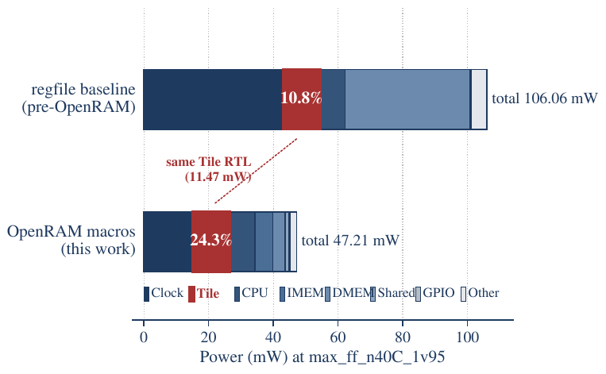
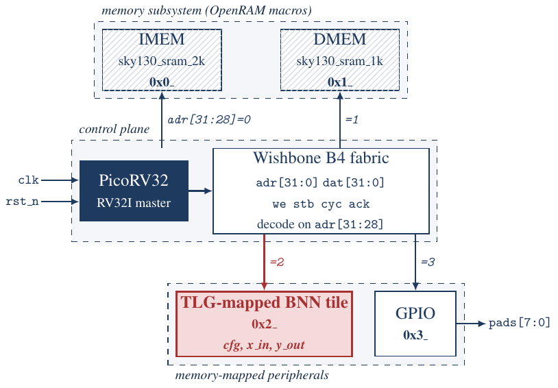
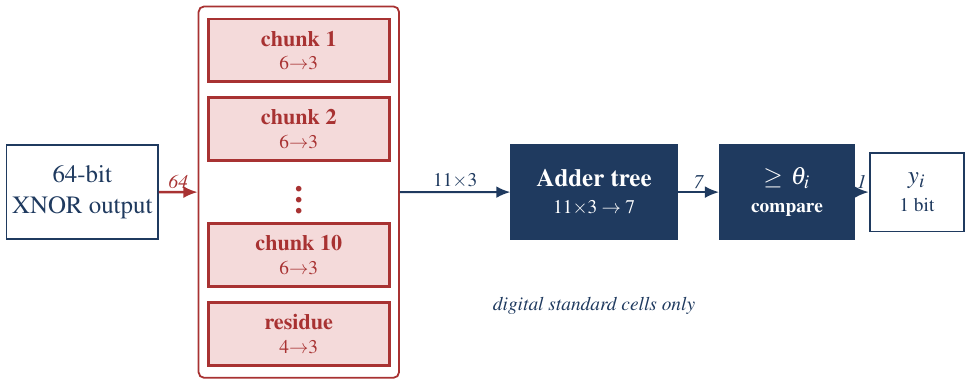
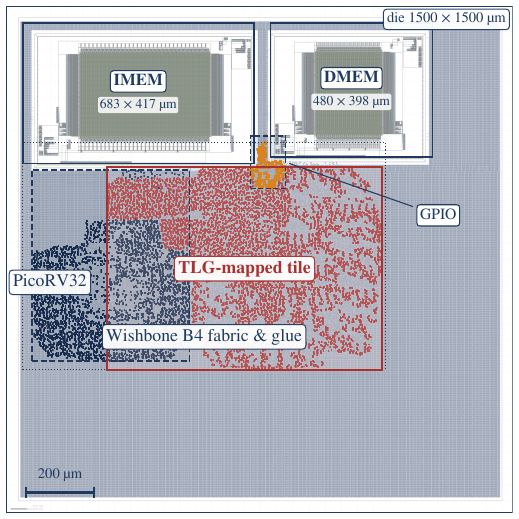

# TINKER

**A fully-digital threshold-logic-mapped BNN inference SoC in SkyWater sky130A**

TINKER is a complete RISC-V inference SoC built with open tools from RTL to
GDS. It hosts a sixteen-neuron binary neural network (BNN) tile next to a
PicoRV32 core, a Wishbone B4 fabric, and OpenRAM instruction and data
memories. The tile computes XNOR / popcount / threshold neurons through a
**chunked-LUT threshold-logic decomposition** made only from ordinary
`sky130_fd_sc_hd` standard cells. It needs no analog, current-mode,
memristive, or flash threshold primitive.

This repository holds the RTL, testbenches, firmware, training scripts,
LibreLane configurations, and result reports for the paper:

> A. Sahruri and M. Margala, "TINKER: A Fully-Digital Threshold-Logic-Mapped
> BNN Inference SoC," *2026 IEEE 39th International System-on-Chip Conference
> (SOCC)*, 2026. Accepted as a poster (EDAS #1571290529).

🌐 **Interactive explainer:** <https://abdullahsahruri.github.io/tinker/>. Scroll through the design and run the deployed network in your browser.

📄 **Poster:** [PDF in this repo](docs/poster/tinker_socc2026_poster.pdf) ·
[Google Drive](https://drive.google.com/file/d/19704OuEIZQ9zVoQLKQsWt_MiRe8qG9CL/view)

---

## Headline results

| Metric | Value | Source |
|---|---|---|
| MNIST accuracy (full 10 000-image test set) | **85.60 %** (95 % Wilson CI [84.90, 86.27]) | `results/phase4_prep/full_mnist_accuracy_14x14.json` |
| SoC RTL simulation vs. integer golden | **16/16 bit-exact** | `scripts/run_soc_bnn.sh` |
| Total post-P&R power (`max_ff_n40C_1v95`) | **47.21 mW** | `results/phase3/power/max_ff_n40C_1v95/power.metrics.json` |
| Energy per inference @ 100 MHz | **8.06 µJ** (124 113 inf/J) | 17 068 cycles × 10 ns × 47.21 mW |
| TLG tile share of SoC power | **24.3 %** (11.47 mW), largest active datapath bucket | same as above |
| Die | 1.5 × 1.5 mm² (2.25 mm²) | `flow/phase3_soc/config.json` |
| Timing @ `nom_tt_025C_1v80`, 100 MHz | +0.51 ns setup / +0.37 ns hold | `docs/PHASE3_5_NOTES.md` |
| Physical verification | KLayout DRC 0 · Netgen LVS 0 · KLayout XOR 0 · antenna 0 | `docs/PHASE3_5_NOTES.md` |

The headline finding: swapping the register-file IMEM/DMEM for OpenRAM
macros cuts SoC power from **106.06 mW to 47.21 mW**, while the tile's
power (byte-identical netlist) stays at 11.47 mW. The tile's share of the
budget therefore rises from **10.8 % to 24.3 %**. Once memory stops
dominating, BNN compute becomes a first-order optimization target.

<p align="center">
  
</p>

---

## Architecture

<p align="center">
  
</p>

| Block | Implementation | Address |
|---|---|---|
| CPU | PicoRV32 RV32I, sole Wishbone B4 classic master (`vendor/picorv32/`) | — |
| IMEM | OpenRAM `sky130_sram_2kbyte_1rw1r_32x512_8`, 1 wait state | `0x0000_0000` |
| DMEM | OpenRAM `sky130_sram_1kbyte_1rw1r_32x256_8`, 1 wait state | `0x1000_0000` |
| BNN tile | `tile_tlg_ld` + `wb_tile_wrapper` (512-byte window) | `0x2000_0000` |
| GPIO | simulation-observability port, `pads[7:0]` | `0x3000_0000` |

Address decode is on `adr[31:28]`, and the whole design runs on one 100 MHz
clock. Reset is asserted asynchronously and released synchronously. Firmware
boots bare-metal from `PROGADDR_RESET = 0`.

### The threshold-logic tile

Each of the 16 neurons computes

```
y_i = [ popcount(x XNOR w_i) >= θ_i ]      x, w_i ∈ {±1}^64,  θ_i 7-bit
```

The 64-input threshold function is **not** built as a high-fan-in analog
gate. The XNOR vector is split into ten 6-bit chunks plus one 4-bit
residue. Each chunk's popcount is a small Boolean function (6→3 or 4→3)
that Yosys maps onto sky130 mux/AOI cells. The eleven 3-bit subcounts feed
a width-7 adder tree and a magnitude comparator against θ_i. Results come
out two cycles after `x_valid`.

<p align="center">
  
</p>

Weights (16 × 64 bit) and thresholds (16 × 7 bit) sit in a configuration
register file, loaded once per network. The Wishbone wrapper exposes
two-phase LO/HI writes for 64-bit values and polled `STATUS.BUSY` and
`YOUT` registers. Writes made while `BUSY = 1` are dropped on purpose, so a
misbehaving program hangs visibly instead of silently corrupting an
in-flight evaluation.

### Deployed network

```
28×28 uint8 ─► 2×2 avg-pool ─► 14×14 ─► four 7×7 quadrants
            ─► per-quadrant median binarization (49 ±1 bits each)
            ─► 4 × BinaryLinear(49→16) + BN + sign      [tile evals 1–4]
            ─► concat(64) ─► BinaryLinear(64→10)         [tile eval 5]
```

Grouping is a hardware-shape choice: each branch fits one 64-input tile
evaluation. In a float proxy, the grouped model trails an unconstrained
196→64 model by only 0.87 pp. Batch-norm is folded into per-neuron integer
thresholds. The firmware (~1.5 KB of RV32I) runs one inference in 17 068
cycles (170.7 µs at 100 MHz).

### Floorplan

<p align="center">
  
</p>

---

## Repository layout

```
rtl/
  soc/              soc_top, Wishbone interconnect, IMEM/DMEM/GPIO slaves, tile wrapper
  tile_tlg_ld/      ★ loadable chunked-LUT TLG tile (the one integrated in the SoC)
  tile_tlg_hc/      TLG tile with hard-coded weights (3 seeds)
  tile_handopt_*/   adder-tree popcount baselines (loadable + hard-coded)
  tlg/ handopt/ naive/   single-neuron variants from Phase 1 (5 seeds each)
tb/                 SystemVerilog testbenches + hex stimulus/expected vectors
firmware/
  smoke/            boot smoke test
  inference/        BNN inference firmware (main.c, weights_14x14.h, linker.ld)
flow/
  common/           SDCs (neuron, tile, soc)
  phase1_*/         neuron-level LibreLane configs (per seed)
  phase2_*/         tile-level LibreLane configs
  phase3_soc/       full-SoC config, macro placement, SRAM blackbox stub
scripts/            generators, training, golden models, run/collect scripts, STA TCL
data/               trained weights (.npz/.pt) and the 16-image test set
results/            committed metrics, power reports, per-bucket cell lists, figures
docs/               per-phase engineering notes (design decisions, numbers, caveats)
paper/              review-version LaTeX source + all figure sources
site/               interactive web explainer (GitHub Pages); model.json via scripts/export_site_model.py
camera-ready/       SOCC 2026 camera-ready LaTeX (see camera-ready/SUBMISSION.md)
vendor/picorv32/    upstream PicoRV32 (ISC license)
```

---

## Getting started

### Toolchain (pinned; see `docs/PHASE0_NOTES.md`)

| Tool | Version |
|---|---|
| LibreLane (Python package **and** Docker image) | **3.0.3** (`ghcr.io/librelane/librelane:3.0.3`) |
| sky130 PDK (via volare 0.20.6) | commit `8afc8346a57fe1ab7934ba5a6056ea8b43078e71` |
| Icarus Verilog | 11.0 |
| RISC-V GCC | `riscv64-unknown-elf-gcc` 10.2.0 |
| Python | 3.10 (numpy, torch, torchvision for training) |
| Docker | required by LibreLane |

```bash
git clone https://github.com/abdullahsahruri/tinker.git && cd tinker
python3 -m venv .venv && . .venv/bin/activate
pip install 'librelane==3.0.3' 'volare==0.20.6' numpy torch torchvision
volare enable --pdk sky130 --pdk-root ./pdk 8afc8346a57fe1ab7934ba5a6056ea8b43078e71
docker pull ghcr.io/librelane/librelane:3.0.3
source scripts/env.sh          # activates .venv, points PDK_ROOT at ./pdk, cleans PATH
```

The PDK lives inside the project (`pdk/`, gitignored), not in `~/.volare`.

### Reproduce the paper

```bash
source scripts/env.sh

# 1. Functional verification (minutes)
scripts/check_soc_elab.sh                   # SoC elaboration
scripts/run_tb_wb_tile_wrapper.sh           # wrapper TB: 10/10 PASS
scripts/run_soc_smoke.sh                    # firmware boot smoke test
scripts/run_soc_bnn.sh --skip-train         # 16-image SoC inference: 16/16 PASS vs integer golden
python scripts/eval_full_mnist_14x14.py     # full 10K MNIST: 85.60 %  (needs MNIST .gz in data/mnist/, see below)

# 2. Physical implementation (~80 min, ~3 GiB peak)
scripts/run_soc_pnr.sh                      # -> flow/phase3_soc/runs/phase3_soc/final/

# 3. Activity-aware power (~12 s per corner)
vvp /tmp/tb_soc_bnn +vcd
python scripts/flatten_vcd_hierarchy.py /tmp/tb_soc_bnn.vcd /tmp/tb_soc_bnn.flat.vcd --src-scope tb_soc_bnn.dut
python scripts/vcd_to_activity_tcl.py /tmp/tb_soc_bnn.flat.vcd --src-scope tb_soc_bnn.dut \
       --clock-period-ns 10 -o results/phase3/power/buckets/activities.tcl
scripts/run_soc_power.sh max_ff_n40C_1v95
scripts/run_soc_power.sh nom_tt_025C_1v80
python scripts/collect_phase3.py            # -> results/phase3/comparison_baseline_vs_openram.{csv,md}

# 4. Paper
make -C camera-ready                        # 6-page IEEE PDF (figure PDFs are committed)
```

Retraining from scratch: `python scripts/train_bnn.py --net 14x14` (hard-tanh
STE, OneCycleLR, 30 epochs). It also downloads the MNIST idx files into
`data/mnist/` (gitignored), which the full-test-set evaluation reads.
Without `--skip-train`, `run_soc_bnn.sh` retrains
when the weights are missing or stale.

---

## Project history

The work progressed in gated phases. Each phase has a notes file in `docs/`
that records its numbers, decisions, and dead ends.

| Phase | What | Key result | Notes |
|---|---|---|---|
| 0 | Toolchain bring-up, hello-world RTL→GDS | flow works end-to-end | `PHASE0_NOTES.md` |
| 1 | Single 64-input neuron: naive vs. hand-optimized adder tree vs. TLG (5 seeds, 15 P&R runs) | TLG **−48 % power** vs. hand-opt, +19 % area | `PHASE1_RESULTS.md` |
| 2A–2B.5 | 16-neuron tiles, hard-coded and loadable, TLG vs. adder tree | TLG-hc smaller, faster, and lower power on every seed | `PHASE2A/2B/2B5_NOTES.md` |
| 2C | Activity-aware tile power (1024 random vectors, 3 seeds) | TLG advantage **80.3 %** (hc) / **49.1 %** (ld) | `PHASE2C_NOTES.md` |
| 3A–3D | SoC architecture, wrapper, PicoRV32 bring-up, 7×7 BNN firmware | 16/16 SoC inference PASS, 71.12 % MNIST | `PHASE3A–3D_NOTES.md` |
| 3E | Full SoC P&R with register-file memories | 106.06 mW, tile = 10.8 % | `PHASE3E_BASELINE_NOTES.md` |
| 3.5 | OpenRAM IMEM/DMEM macros | 47.21 mW, tile = 24.3 % | `PHASE3_5_NOTES.md` |
| 4.5 | Grouped 14×14 network, same silicon | **85.60 %** (+14.48 pp) at +1.0 % energy | `PHASE4_5_NOTES.md` |

A roll-up of Phases 3–4.5 is in `docs/PHASE3_SUMMARY.md`, and the full SoC
spec is in `docs/PHASE3_ARCHITECTURE.md`.

---

## Scope and caveats

These limits are stated in the paper and repeated here so the numbers
aren't over-read:

- **Slow-corner timing.** 100 MHz closes at `nom_tt_025C_1v80`. At
  `nom_ss_100C_1v60`, SoC setup fails because LibreLane 3.x has only a
  single TT-corner Liberty for the OpenRAM macros. The standalone tiles
  reach 73.81 MHz (TLG) and 77.51 MHz (adder tree) at the slow corner.
- **Power annotation.** The switching activity comes from the 7×7
  deployment's 16-image testbench, run on the netlist that the 14×14
  deployment leaves byte-identical. The 14×14 energy scales that power by
  its own cycle count. Only 47 of 1 210 interior VCD signals survive
  synthesis as named nets, so combinational power is likely under-counted
  by up to about 5 %. The "tile" bucket includes its Wishbone wrapper, and
  1.98 mW (4.2 %) is not attributed to any bucket.
- **Scale.** One 16-neuron, 64-input tile, a grouped MNIST MLP, and no
  tape-out. The goal is to show that a threshold-logic decomposition
  survives SoC integration in a portable open flow, not to compete with
  advanced-node accelerators on raw efficiency.
- **Not in git.** LibreLane run directories (~12 GB), GDS/DEF/SPEF/SDF,
  VCD/SAIF traces, logs, and MNIST downloads are gitignored. They are
  regenerated by the commands above. The small reports they produce
  (`power.rpt`, `power.metrics.json`, cell buckets, summaries) are committed.

---

## Citation

```bibtex
@inproceedings{sahruri2026tinker,
  author    = {Sahruri, Abdullah and Margala, Martin},
  title     = {{TINKER}: A Fully-Digital Threshold-Logic-Mapped {BNN} Inference {SoC}},
  booktitle = {2026 IEEE 39th International System-on-Chip Conference (SOCC)},
  year      = {2026}
}
```

## License

MIT; see [`LICENSE`](LICENSE). `vendor/picorv32/` keeps its upstream ISC license.
The paper sources under `paper/` and `camera-ready/` are the authors' manuscript;
the published version is © 2026 IEEE.

## Acknowledgments

PicoRV32 by Claire Xenia Wolf (YosysHQ, ISC license). The flow is built on
LibreLane, OpenROAD, Yosys, Magic, KLayout, Netgen, OpenRAM, and the
SkyWater sky130 open PDK.

School of Computing and Informatics, University of Louisiana at Lafayette.
